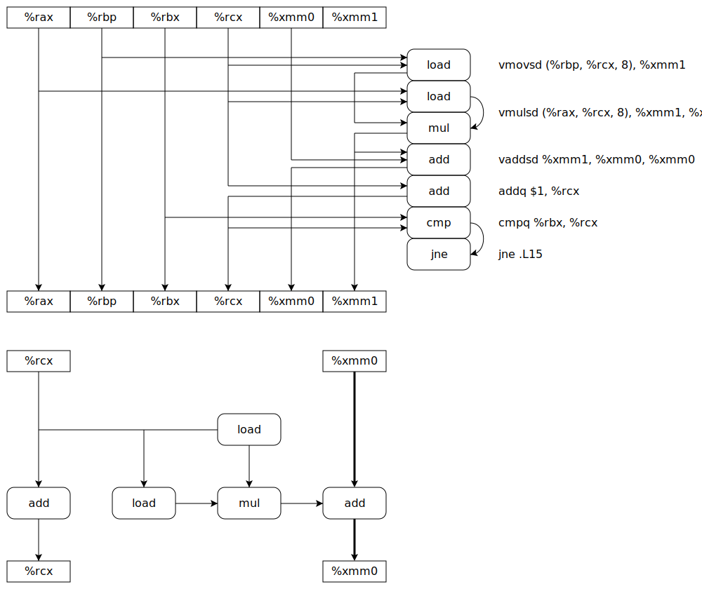

# HW 5 #

## 4.54 & 4.56 ##

- 4.54: see pipe-nt.hcl
- 4.56: see pipe-lf.hcl

## 5.13 ##

### A ###

As is shown in the svg, the critical path is the add sequence of %xmm0.

### B ###

3.00

### C ###

1.00

### D ###

Because the mul instruction in the function is data independent from each other, so they can be pipelined and break the lower bound of latency of mul.

## 5.14 ##

### A ###

Because there are still N mul instructions in the function whether there is a loop unrolling. The issue clocks of mul instruction is 1 and cannot be paralleled. So the lower bound of CPE is 1.00.

### B ###

Because the loop unrolling do not change the critical path of the data dependent flow, and 3.00 is the lower bound of the critical path.

Try multiple accumulators(eg. 6 x 6 loop unrolling) and reassociation transformation.
